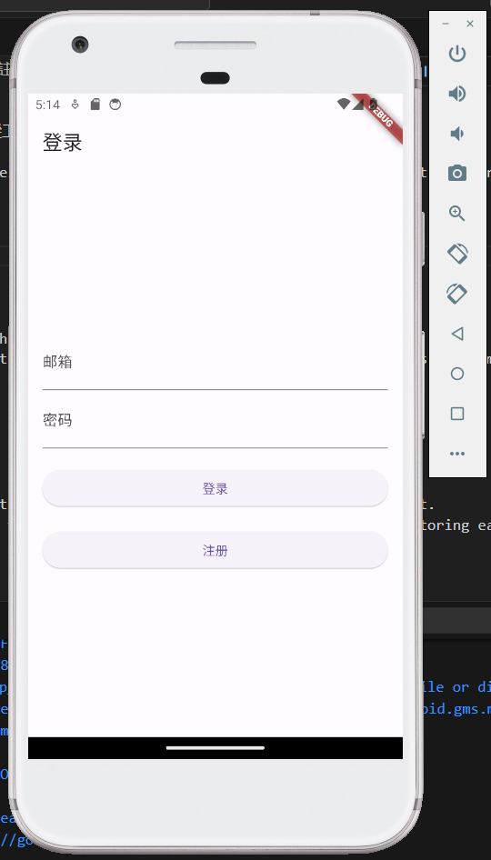

# 工作管理 App (Work Management App)

這是一個使用 Flutter 開發的工作管理應用程式，旨在幫助員工和管理者更有效地管理和跟蹤工作進度。

This is a work management application developed using Flutter, designed to help employees and managers efficiently manage and track work progress.

## 功能介紹 (Features)

### 1. 用戶註冊 (User Registration)
- **員工註冊**: 員工可以通過應用自行註冊帳戶。
- **管理者註冊**: 管理者的帳戶由後台進行註冊，以便確保只有授權人員可以訪問管理功能。

- **Employee Registration**: Employees can register their accounts through the app.
- **Admin Registration**: Admin accounts are registered through the backend to ensure that only authorized personnel can access management features.

### 2. 管理者功能 (Admin Features)
- **查看部門員工專案進度**: 管理者可以登入後查看所屬部門中每個員工的專案進度情況。
- **日曆視圖**: 管理者能夠通過日曆查看對應日期的工作進度，方便進行排程和進度監控。

- **View Department Project Progress**: Admins can log in to view the project progress of each employee within their department.
- **Calendar View**: Admins can view work progress on specific dates through the calendar, making scheduling and progress monitoring easier.

### 3. 員工功能 (Employee Features)
- **查看工作清單**: 員工登入後可以查看自己被分配到的工作清單。
- **認領工作**: 員工可以認領尚未分配的工作，並開始進行處理。
- **回報工作進度**: 員工可以實時回報工作進度，方便管理者隨時掌握工作情況。

- **View Work List**: Employees can log in to view their assigned work list.
- **Claim Tasks**: Employees can claim unassigned tasks and begin working on them.
- **Report Work Progress**: Employees can report their work progress in real-time, allowing managers to keep track of the situation.

## 使用技術 (Technologies Used)

- **Flutter**: 前端 UI 和用戶互動界面的開發。
- **Firebase**: 後端服務，負責用戶註冊、登入及資料管理。

- **Flutter**: Used for frontend UI and user interaction development.
- **Firebase**: Backend services, responsible for user registration, login, and data management.

## 安裝與設定 (Installation and Setup)

1. **環境配置 (Environment Setup)**:
   - 安裝 Flutter SDK [官方安裝指南](https://flutter.dev/docs/get-started/install)
   - 安裝必要的 IDE 插件（如 VS Code 或 Android Studio 的 Flutter 插件）

   - Install Flutter SDK [Official Installation Guide](https://flutter.dev/docs/get-started/install)
   - Install necessary IDE plugins (e.g., Flutter plugins for VS Code or Android Studio)

2. **Firebase 設定 (Firebase Setup)**:
   - 在 Firebase 控制台中創建專案，並下載 `google-services.json` (Android) 或 `GoogleService-Info.plist` (iOS) 檔案。
   - 在專案中配置 Firebase，具體可參考 `firebase_options.dart` 文件。

   - Create a project in the Firebase console and download the `google-services.json` (for Android) or `GoogleService-Info.plist` (for iOS) file.
   - Configure Firebase in the project, referring to the `firebase_options.dart` file for details.

3. **運行專案 (Running the Project)**:
   - 執行 `flutter pub get` 安裝所有依賴包。
   - 使用命令 `flutter run` 啟動應用程式。

   - Run `flutter pub get` to install all dependencies.
   - Use the command `flutter run` to launch the application.

## 專案結構 (Project Structure)

- `lib/` : 應用程式的主要源代碼。
  - `pages/` : 各個功能模組的頁面。
  - `widgets/` : 自訂 Flutter 組件。
  - `database/` : firebase處理

- `lib/` : The main source code of the application.
  - `pages/` : Pages for each feature module.
  - `widgets/` : Custom Flutter widgets.
  - `database/` : Firebase handling.

## 示範影片 (Demo Video)

點擊上方圖片觀看示範影片

## 聯繫方式 (Contact)

如有任何問題或建議，請聯繫我們：[chanhin17@gmail.com]

If you have any questions or suggestions, please contact us at: [chanhin17@gmail.com]
